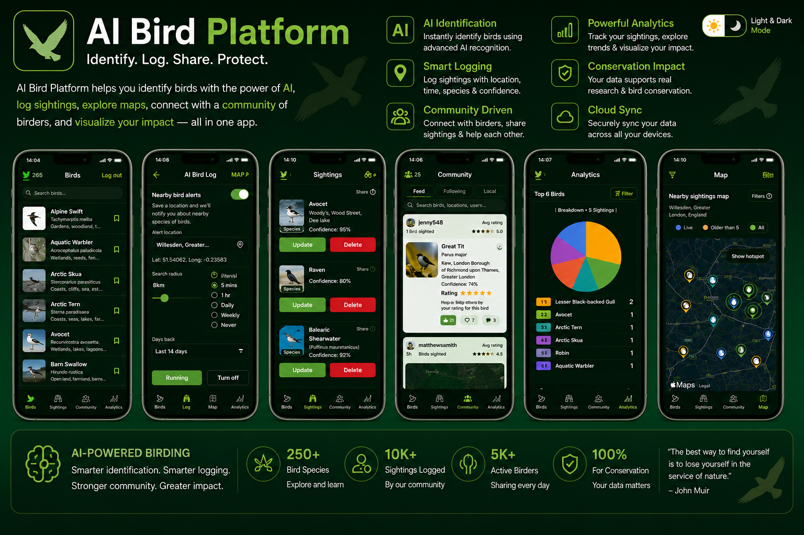
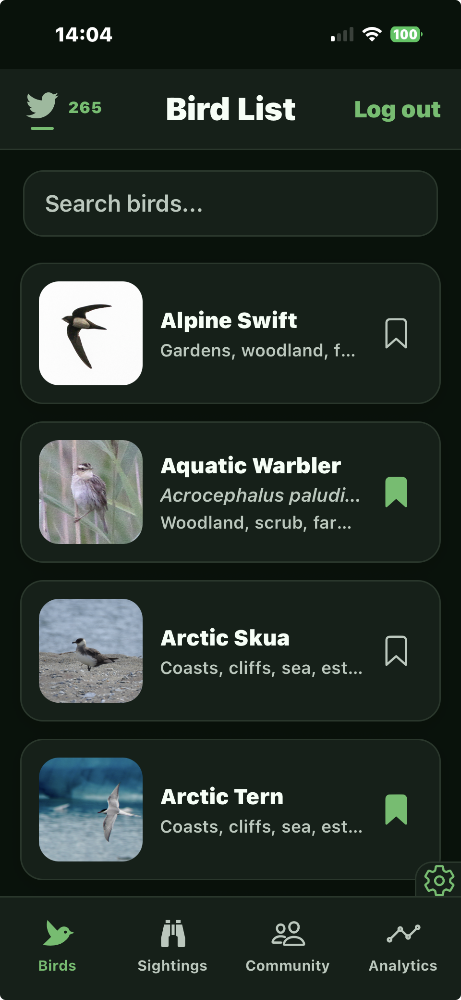
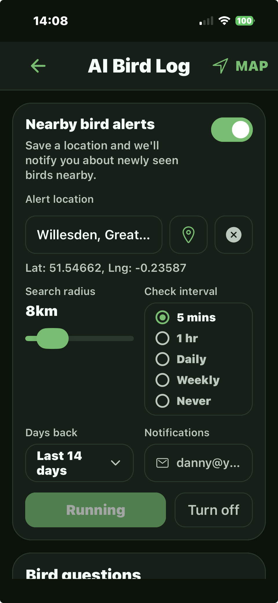
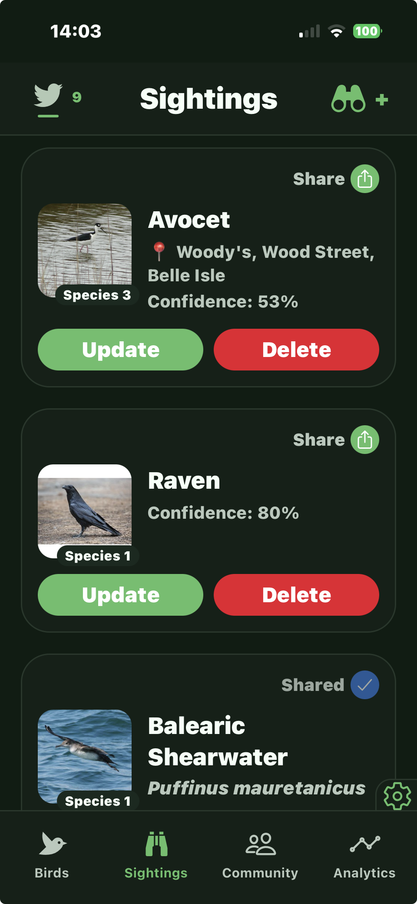
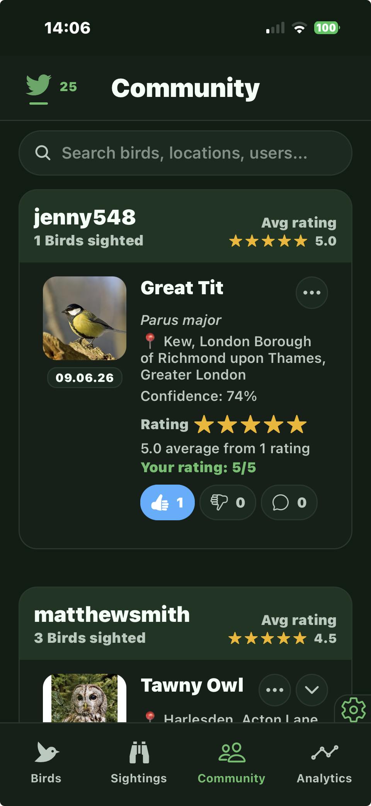
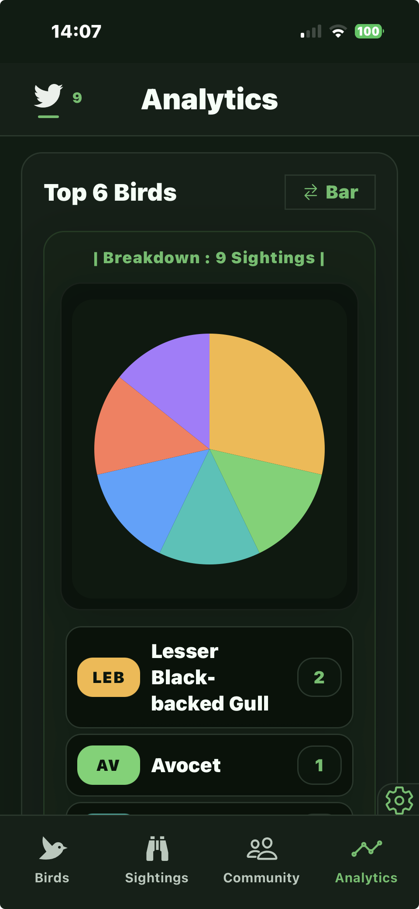
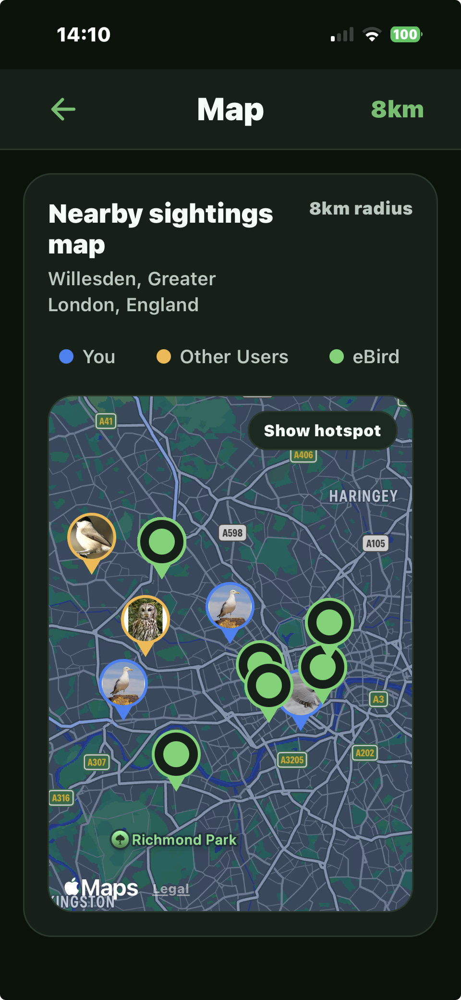
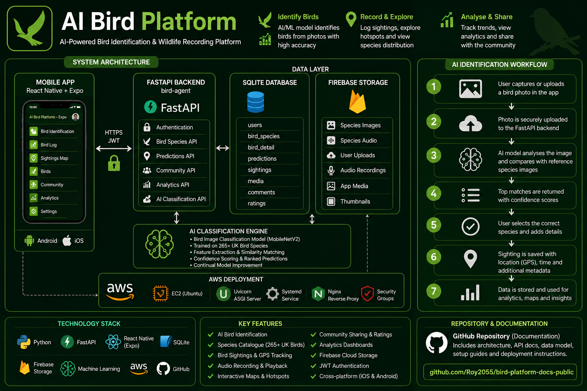
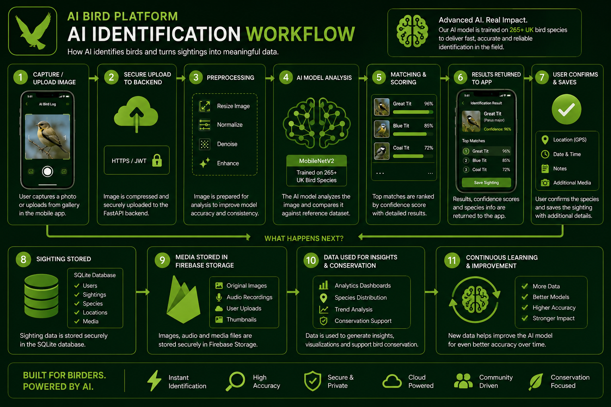

# Bird Platform Public Docs

AI-powered bird identification and wildlife recording platform built with Python, FastAPI, React Native (Expo), Firebase Storage, SQLite and Machine Learning.

Built as a full-stack mobile and backend application with AI classification, cloud media handling, analytics, community features, and geospatial mapping.

## Platform Screens

| Bird List | AI Bird Log | Sightings |
|-----------|-------------|-----------|
|  |  |  |

| Community | Analytics | Map |
|------------|-----------|------|
|  |  |  |

## Overview

Bird Platform is an AI-powered bird identification and wildlife recording platform designed and implemented as a full-stack mobile and backend system. It combines mobile image and audio capture, secure API services, cloud media storage, machine learning classification, analytics dashboards, community features, and interactive mapping into a single end-to-end product.

## Features

- AI bird identification
- GPS sighting tracking
- Community sharing
- Analytics dashboards
- Interactive maps
- Cloud media storage

## Architecture And Technical Documentation

This repository contains the public architecture and technical documentation for **Bird Platform**. It is intended as a public technical overview for recruiters, hiring managers, collaborators, and engineering stakeholders who want to understand how the platform is designed and delivered while the full source remains private.

The documented architecture covers:

- product overview
- system architecture
- AI workflow design
- backend responsibilities
- frontend structure
- moderation workflows
- Firebase media handling
- deployment approach

## Architecture Diagram

This diagram provides a high-level view of how the mobile app, backend APIs, media storage, analytics, mapping, and AI classification workflow fit together across the platform.

## AI Identification Workflow

This workflow shows how bird images move through the platform from mobile capture to AI prediction. The process includes image upload, cloud storage, FastAPI API processing, machine learning classification, confidence scoring, species matching, database persistence, and presentation of ranked identification results back to the user.

## What This Repository Demonstrates

This public documentation repository shows:

- full-stack mobile and backend application design
- FastAPI service architecture and API responsibilities
- React Native mobile application structure
- Firebase Storage integration for cloud-based media handling
- AI-powered species identification workflow
- analytics, geospatial mapping, and community feature design
- deployment and systems thinking across the platform

## What Is Intentionally Excluded

This public repository does **not** include:

- the full private source code
- internal runbooks
- local environment details
- operational troubleshooting notes
- sensitive configuration or implementation material

## Purpose

The goal of this repository is to provide a clear view of the architectural thinking, platform responsibilities, and delivery approach behind Bird Platform. It is designed to show how the mobile app, backend services, media workflows, moderation model, AI pipeline, and deployment approach fit together as a coherent product and engineering project.

## Audience

This repository is suitable for:

- CV and professional profile links
- LinkedIn featured links
- recruiter and hiring manager review
- architecture and product walkthroughs
- technical discussion around system design and delivery decisions

## License

Copyright © Delroy Peters. All rights reserved.

This repository is provided for documentation and review purposes only. Reuse, redistribution, modification, or commercial use of the contents is not permitted without prior written permission.
