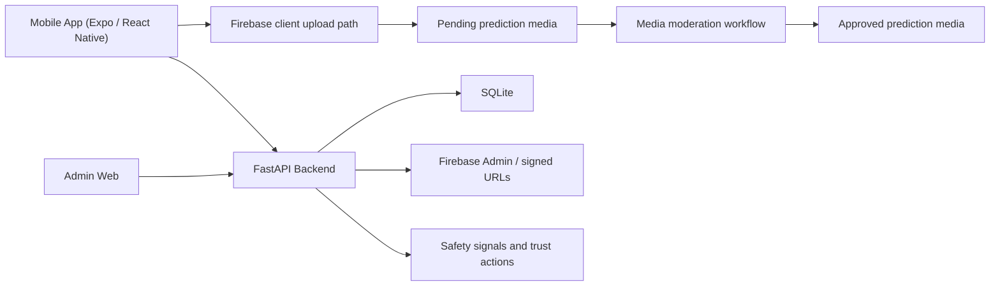

# Architecture

Bird Platform is built as a connected mobile-plus-backend platform with media and moderation layers.

## Main design choices

- **Prediction-centered data model** for community sharing rather than a separate post model
- **SQLite-backed app database** for portability and simpler project operations
- **Firebase Storage** for media handling and signed URL resolution
- **Forward-only moderation workflow** for clear, auditable admin decisions
- **Separate support, moderation, trust and safety, and block-user lanes** for clearer operational behavior
- **Browser-based admin workspace** as the primary operational admin surface
- **Expo / React Native** for a practical cross-platform mobile workflow
- **FastAPI** for straightforward Python API delivery and integration
