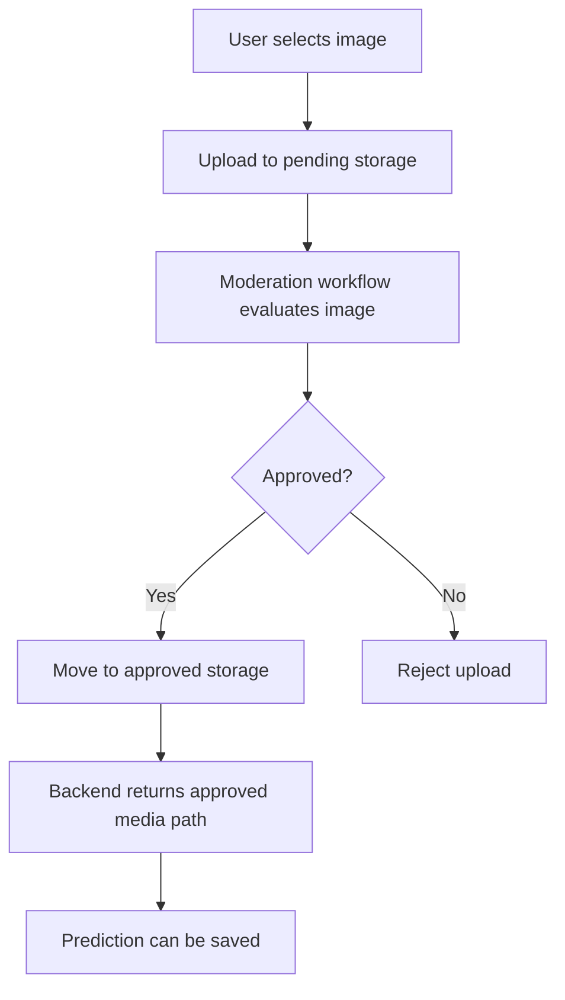

# Firebase And Media

Firebase is used primarily for media storage and signed URL resolution.

## Main media responsibilities

- prediction image uploads
- prediction sound uploads
- species media storage
- signed URL generation for app consumption
- moderation-aware prediction image workflow

## Prediction image moderation path

## Cleanup maturity

The platform also includes cleanup support so deleted predictions and deleted accounts do not leave media behind unnecessarily.
