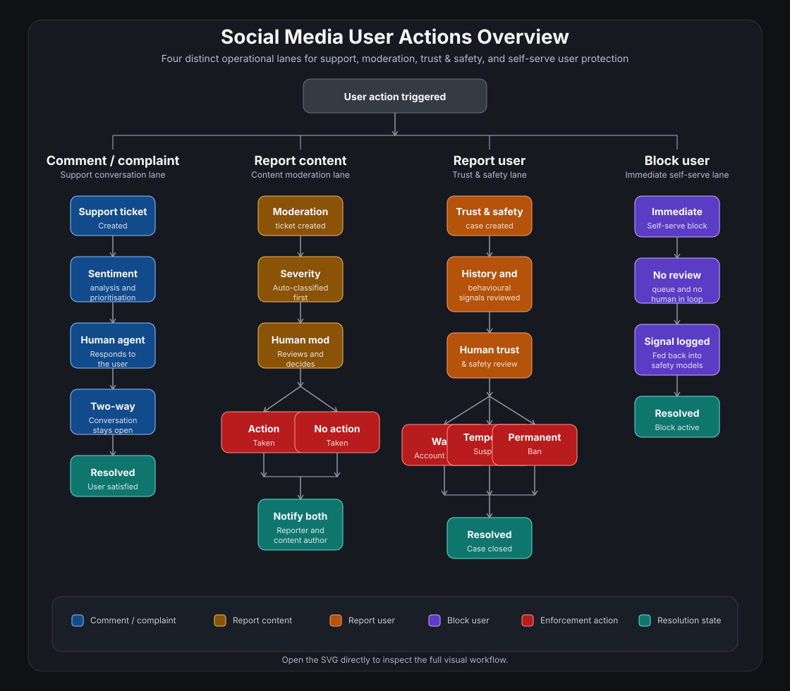

# Moderation

Bird Platform includes moderation as a product feature, not an afterthought.

## User safety actions

Users can:

- report a community post
- report a comment
- report a user
- block another user
- review moderation case updates
- respond after a moderation decision has been made

## Safety And Ticketing Model

Bird Platform treats user safety actions as four distinct operational lanes rather than one generic queue:

- comment / complaint
- report content
- report user
- block user

Each lane has its own workflow, risk profile, and resolution model.

[Open the interactive workflow page](safety-workflow.md)

[Open the SVG directly](social-media-user-actions-overview.svg)

## Flow Summary

### Comment / complaint

This is the support lane.

- creates a support ticket
- can be prioritised with sentiment analysis
- requires a human response
- stays open as a two-way conversation until the user is satisfied

### Report content

This is the content moderation lane.

- creates a moderation ticket
- severity is classified before human review
- a moderator makes the decision
- outcome is binary:
  - action
  - no action
- both the reporter and the content author are notified

In coding terms, this lane now stores explicit severity and outcome data rather than only free-text review notes.

### Report user

This is the trust and safety lane.

- more serious than a single content report
- reviews full account history and behavioural signals
- supports escalating outcomes:
  - warn
  - temporary suspend
  - permanent ban

In coding terms, this lane now supports separate trust-and-safety action records and aggregated safety signals for the reported account.

## Report management UI

The moderation and trust-and-safety workflows are also reflected in a browser-based report-management interface.

In product terms, that UI is designed around:

- pipeline columns that reflect the case lifecycle:
  - new
  - triaging
  - in review
  - decision
  - action
  - closed
- ticket cards with consistent type badges for:
  - comment
  - report content
  - report user
  - block
- SLA-style queue health signals so moderators can quickly identify:
  - healthy tickets
  - at-risk tickets
  - breached tickets
- a detail panel that shows the selected case as a timeline through the workflow
- multiple operator views such as:
  - pipeline
  - list
  - analytics

This matters because the workflow model is not only a backend concept. It is also a visible operational model for human moderators and reviewers.

The intended behavior is stage-aware:

- only the current actionable stage is shown while the case is in progress
- future stages remain hidden until they become relevant
- resolved cases collapse into a compact notification-and-history state
- resolved cases can still be reopened when follow-up review is required

### Block user

This is the self-serve safety lane.

- immediate user action
- no review queue
- no human in the loop
- no ticket required
- block events are still logged as safety signals

That means block events can still contribute to detecting repeated harmful behaviour even though the action itself is silent and immediate.

## Enforcement And Resolution

Red nodes in the workflow represent enforcement actions across the report flows.

Teal nodes represent resolution states, including:

- support conversation resolved
- moderation case resolved
- trust and safety case resolved
- block state applied

## Why this matters

This supports:

- user safety
- clearer separation between support, moderation, trust and safety, and self-serve blocking
- auditable admin workflows where human review is required
- user-facing visibility into moderation outcomes
