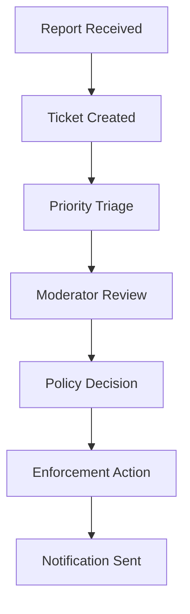

# Moderation

Bird Platform includes moderation as a product feature, not an afterthought.

## User safety actions

Users can:

- report a community post
- report a comment
- report a user
- block another user
- review moderation case updates
- respond after a moderation decision has been made

## Admin workflow

Moderation cases move forward one step at a time:

1. Report Received
2. Ticket Created
3. Priority Triage
4. Moderator Review
5. Policy Decision
6. Enforcement Action
7. Notification Sent

## Why this matters

This demonstrates product thinking around:

- user safety
- auditable admin workflows
- separation between support messaging and moderation cases
- user-facing visibility into moderation outcomes
